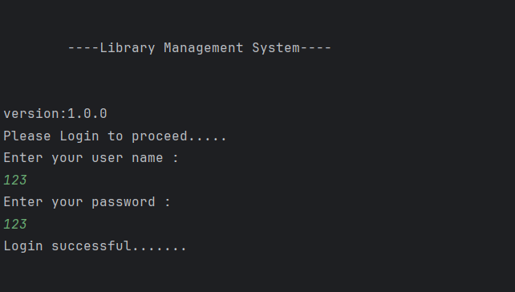
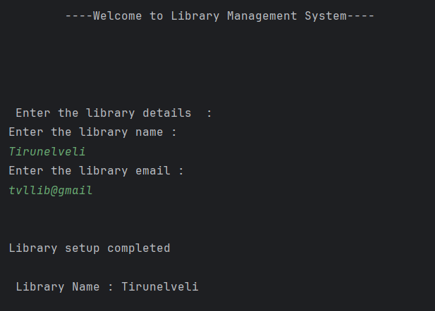
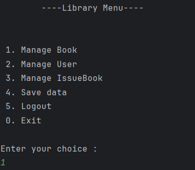
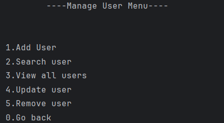
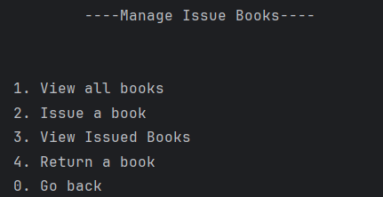

# Library Management System

Library Management system is a console application, I have developed when i am learning OOPS in java. Right now it is at the first version of the application. I has a User interface with some menu and functionality and integrated JSON for the backend. In future updates , will connect a backend SQL server to it. 

## Menu Control flow

## Output Screenshot

